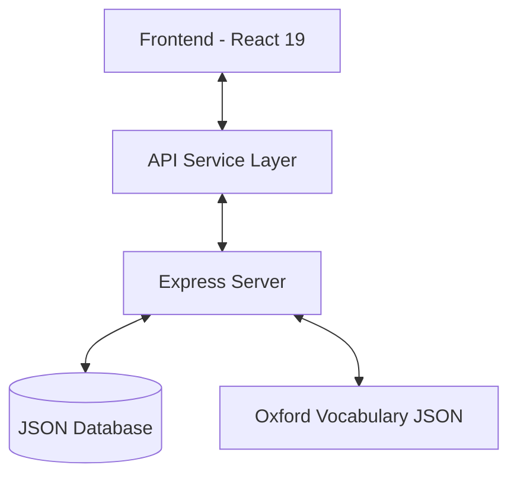

# LingoMe - System Architecture

> System diagrams, data flow, and module maps for the LingoMe project.

## 1. High-Level Overview



## 2. Core Modules

| Module | Route Pattern | Data Location |
|---|---|---|
| **Vocabulary** | `/vocabulary/:level/:lessonId` | `backend/oxford_classified.json` |
| **Grammar** | `/grammar/:level/:lessonId` | `backend/data/grammar/{level}/*.json` |
| **Reading** | `/reading/:level/:lessonId` | `backend/data/reading/{level}/*.json` |
| **Listening** | `/listening/:level/:lessonId` | `backend/data/listening/{level}/*.json` |
| **Review** | `/review/daily`, `/review/general` | Derived from `wordProgress` |
| **Progress** | `/progress` | Aggregated from all sources below |

**CEFR Levels**: `a1`, `a2`, `b1`, `b2`, `c1`.
**Shared UX Flow**: `LevelSelector` → `LessonSelector` → `DetailPage`.

## 3. Data Flow

### Content (Read-Only)
```
JSON Files → contentDb.js → Express Routes → api.ts → React Query hooks → Component
```

### User Data (Read-Write)
```
user_db.json ↔ userDb.js ↔ userData.js (Generic CRUD) ↔ api.ts ↔ React Query ↔ Component
```

### User Data Collections

| Collection | Description | API Endpoint |
|---|---|---|
| `wordProgress` | Individual word progress (level 1-5, nextReview) | `GET/PATCH /wordProgress` |
| `lessonProgress` | Completed lessons tracking | `GET/POST /lessonProgress` |
| `sessionProgress` | Active/Incomplete session state | `GET/PATCH /sessionProgress` |
| `studyLog` | Daily activity logs (wordsLearned, wordsReviewed) | `GET/PATCH /studyLog` |
| `stats` | Aggregate statistics (streak, totalWordsLearned) | `GET/PATCH /stats` |
| `settings` | User preferences (dailyGoal, theme) | `GET/PATCH /settings` |

## 4. Tech Stack

- **Frontend**: React 19, React Router v7, Tailwind CSS v4, Framer Motion, Zustand, React Query.
- **Backend**: Node.js, Express, JSON Server.
- **AI**: Google Generative AI (Gemini) integration.

## 5. Quick Reference — Task → Files to Modify

| Task | Target Files |
|---|---|
| Add new module | `types/index.ts`, `contentDb.js`, `routes/*.js`, `server.js`, `api.ts`, `queryKeys.ts`, `useApi.ts`, `App.tsx` |
| Modify interface | `types/index.ts`, `contentDb.js`, dependent components |
| Progress tracking | `ProgressPage.tsx`, `Dashboard.tsx`, Module detail pages |
| Navigation items | `Sidebar.tsx`, `App.tsx` |
| API issues | `contentDb.js`, `routes/*.js`, `server.js`, `api.ts`, `useApi.ts` |

---
> 💡 *Coding Law: [PATTERNS.md](./PATTERNS.md).*
> 💡 *Technical Decisions: [DECISIONS.md](./DECISIONS.md).*
